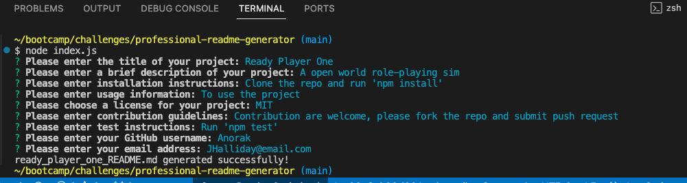
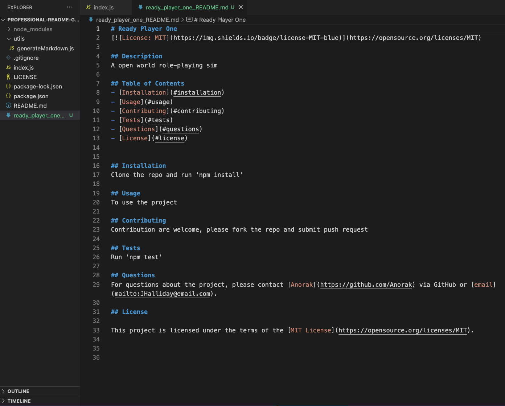

# professional-readme-generator

## Description
Elevate your project's first impression with this professional README generator that empowers you to effortlessly create sleek and comprehensive documentation for your GitHub projects. Say goodbye to manual formatting headaches our intuitive interface and customizable templates ensure your READMEs stand out. Whether you're a seasoned developer or just starting, this is truly the key to unlocking polished project presentation.
## Screen Shot

## Link
(https://youtu.be/F1J_A2IqR7A)
(https://TruTechDad.github.io/professional-readme-generator)